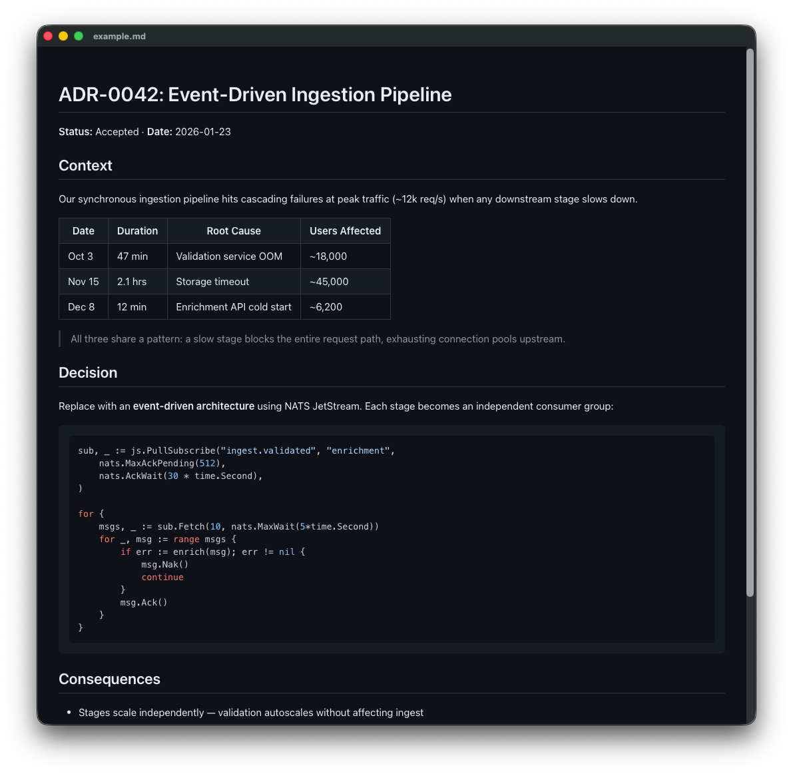

# MDView

A lightweight macOS app for reading Markdown files. Renders `.md` files with GitHub-flavored styling, syntax-highlighted code blocks, Mermaid diagrams, and live reload on file changes.


<p align="center">
  
</p>

## Features

- **Live reload** -- automatically re-renders when the file changes on disk
- **Quick Open** (`Cmd+P`) -- fuzzy-search any Markdown file in the current directory
- **Drag & drop** -- drop a file or folder onto the window to open it
- **Directory-aware** -- open a folder to browse all its Markdown files
- **GitHub styling** -- light and dark themes that follow your system appearance
- **Syntax highlighting** -- fenced code blocks highlighted via highlight.js
- **Mermaid diagrams** -- fenced `mermaid` blocks rendered as SVG, with light/dark theme support
- **External links** -- clicked links open in your default browser
- **No dependencies** -- pure Swift + WebKit, no external packages

## Install

Download the latest DMG from [Releases](../../releases/latest), open it, and drag MDView to Applications.

Since the app isn't signed with an Apple Developer certificate, macOS will block it on first launch. Right-click the app → **Open** → **Open** to bypass the warning. You only need to do this once.

Alternatively, build from source:

```sh
make install
```

This builds a release binary, bundles it into `MDView.app`, and copies it to `/Applications`.

## Build & Run

```sh
# Build and open the app
make run

# Or just build
make
```

## Usage

```sh
# Open a file
open -a MDView README.md

# Open a directory (auto-loads README if present)
open -a MDView ~/projects/my-repo

# Or pass a path directly
.build/release/MDView ~/notes/todo.md
```

Inside the app:

| Shortcut | Action |
|----------|--------|
| `Cmd+O` | Open a file or directory |
| `Cmd+P` | Quick Open (fuzzy file search) |
| `Cmd+R` | Reload current file |
| `Cmd++` | Zoom in |
| `Cmd+-` | Zoom out |
| `Cmd+0` | Reset zoom |

## Project Structure

```
Sources/MDView/
  App.swift              # Entry point, menus, CLI arg handling
  AppState.swift         # Core state: file loading, directory scanning, file watching
  ContentView.swift      # Main window layout, drag & drop, quick open overlay
  MarkdownWebView.swift  # WKWebView wrapper that renders Markdown via marked.js
  HTMLTemplate.swift     # HTML shell with inline CSS and JS bootstrap
  FileWatcher.swift      # DispatchSource-based file system watcher
  DirectoryScanner.swift # Recursive Markdown file discovery with smart directory skipping
  FuzzyMatch.swift       # Fuzzy string matching with streak/boundary bonuses
  QuickOpenView.swift    # Cmd+P palette UI with keyboard navigation
  Log.swift              # Debug logging (enabled via MDVIEW_DEBUG env var)
  Resources/
    marked.min.js        # Markdown parser (marked.js)
    highlight.min.js     # Syntax highlighting (highlight.js)
    mermaid.min.js       # Diagram rendering (mermaid.js)
    github-light.css     # GitHub light theme
    github-dark.css      # GitHub dark theme
```

## How It Works

Markdown is rendered client-side in a `WKWebView` using [marked.js](https://github.com/markedjs/marked), [highlight.js](https://github.com/highlightjs/highlight.js), and [mermaid.js](https://github.com/mermaid-js/mermaid). The JS libraries and CSS themes live in `Resources/` and are bundled via Swift Package Manager -- no network requests, no external runtime dependencies.

File changes are detected via GCD's `DispatchSource` file system events. When the file is modified, the new content is base64-encoded and sent to the web view via `evaluateJavaScript`.

## License

Apache 2.0 -- see [LICENSE](LICENSE).
