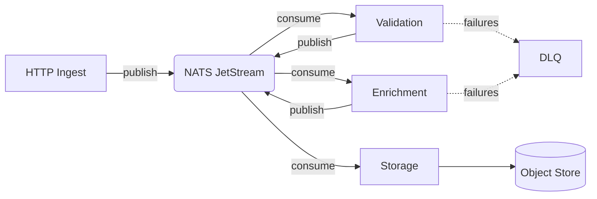

# ADR-0042: Event-Driven Ingestion Pipeline

**Status:** Accepted · **Date:** 2026-01-23

## Context

Our synchronous ingestion pipeline hits cascading failures at peak traffic (~12k req/s) when any downstream stage slows down.

| Date   | Duration | Root Cause                 | Users Affected |
|--------|----------|----------------------------|----------------|
| Oct 3  | 47 min   | Validation service OOM     | ~18,000        |
| Nov 15 | 2.1 hrs  | Storage timeout            | ~45,000        |
| Dec 8  | 12 min   | Enrichment API cold start  | ~6,200         |

> All three share a pattern: a slow stage blocks the entire request path, exhausting connection pools upstream.

## Decision

Replace with an **event-driven architecture** using NATS JetStream. Each stage becomes an independent consumer group:

```go
sub, _ := js.PullSubscribe("ingest.validated", "enrichment",
    nats.MaxAckPending(512),
    nats.AckWait(30 * time.Second),
)

for {
    msgs, _ := sub.Fetch(10, nats.MaxWait(5*time.Second))
    for _, msg := range msgs {
        if err := enrich(msg); err != nil {
            msg.Nak()
            continue
        }
        msg.Ack()
    }
}
```

## Architecture



## Consequences

- Stages scale independently — validation autoscales without affecting ingest
- Backpressure handled naturally via consumer pull model
- Clients get `202 Accepted`, not a final result (*eventual consistency*)
- [x] Team NATS training scheduled for Feb
- [ ] DLQ replay tooling — build before launch
- [ ] Message ordering needs validation for dependent uploads
